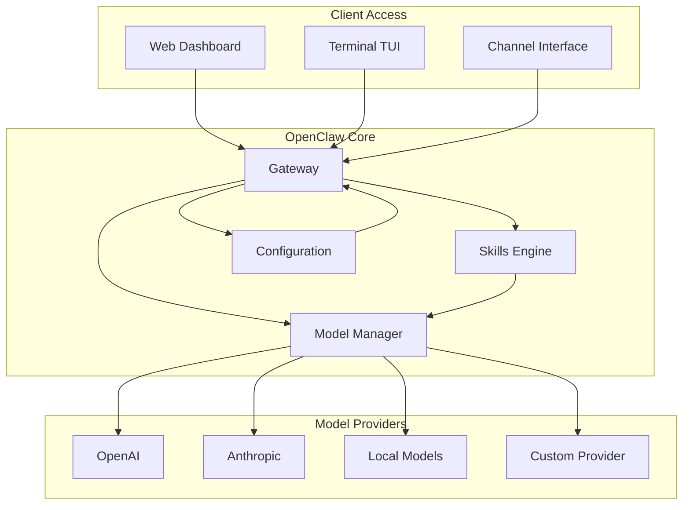

# OpenClaw

## 参考资料

- [openclaw](https://docs.openclaw.ai/)


## 安装

环境：tencentcloud Ubuntu Server 24.04 LTS 64bit

```bash
# 下载安装 Node.js
# 先到官方网站 https://nodejs.org/en/download 获取稳定版本和下载链接
curl -O https://nodejs.org/dist/v24.13.1/node-v24.13.1-linux-x64.tar.xz
tar -xJvf node-v24.13.1-linux-x64.tar.xz

# 添加环境变量
vi ~/.bashrc
export PATH=$PATH:/home/ubuntu/node-v24.13.1-linux-x64/bin
source ~/.bashrc

# 验证安装情况
node --version
npm --version
# 更换为国内镜像
npm config set registry https://mirrors.cloud.tencent.com/npm/

# 下载安装 OpenClaw
curl -fsSL https://openclaw.ai/install.sh | bash
# 初始化配置并启动为守护进程
openclaw onboard --install-daemon
# 检查服务状态
openclaw gateway status
# 启动 web 仪表板
openclaw dashboard
```

## 访问方式

### 远程服务器访问 dashboard
```bash
# 本地终端执行 SSH 隧道转发
ssh -N -L 18789:127.0.0.1:18789 ubuntu@xxx.xxx.xxx.xxx
# 本地浏览器访问
http://127.0.0.1:18789/
```

### 本地直接访问
```bash
openclaw tui
```

## OpenClaw 架构



OpenClaw架构主要包括：

- **Dashboard/Web界面**: 提供图形化管理界面
- **TUI (Terminal UI)**: 终端界面，适合快速操作
- **Channels**: 多种接入渠道，支持不同交互方式
- **Gateway**: 核心网关，处理请求分发和路由
- **Skills Engine**: 技能引擎，扩展系统功能
- **Model Manager**: 模型管理器，统一接入不同模型提供商


## 核心配置文件

```bash
vi ~/.openclaw/openclaw.json
```


## 常用 openclaw 命令行工具

### 配置管理
```bash
# 查看当前配置
openclaw config show

# 设置配置项
openclaw config set <key> <value>

# 重置配置
openclaw config reset

# 导出配置
openclaw config export > backup-config.json

# 导入配置
openclaw config import < backup-config.json
```

### 服务管理
```bash
# 检查网关状态
openclaw gateway status

# 启动网关服务
openclaw gateway start

# 停止网关服务
openclaw gateway stop

# 重启网关服务
openclaw gateway restart

# 查看网关日志
openclaw gateway logs
```

### 模型管理
```bash
# 列出所有可用模型
openclaw models list

# 查看当前默认模型
openclaw models current

# 设置默认模型
openclaw models set <model-name>

# 测试模型连接
openclaw models test <model-name>
```

### 技能管理
```bash
# 列出所有技能
openclaw skills list

# 安装技能
openclaw skills install <skill-name>

# 更新技能
openclaw skills update <skill-name>

# 卸载技能
openclaw skills uninstall <skill-name>

# 查看技能详情
openclaw skills show <skill-name>

# 启用技能
openclaw skills enable <skill-name>

# 禁用技能
openclaw skills disable <skill-name>
```


### 通道管理
```bash
# 列出所有通道
openclaw channels list

# 查看通道状态
openclaw channels status <channel-name>

# 启用通道
openclaw channels enable <channel-name>

# 禁用通道
openclaw channels disable <channel-name>
```

