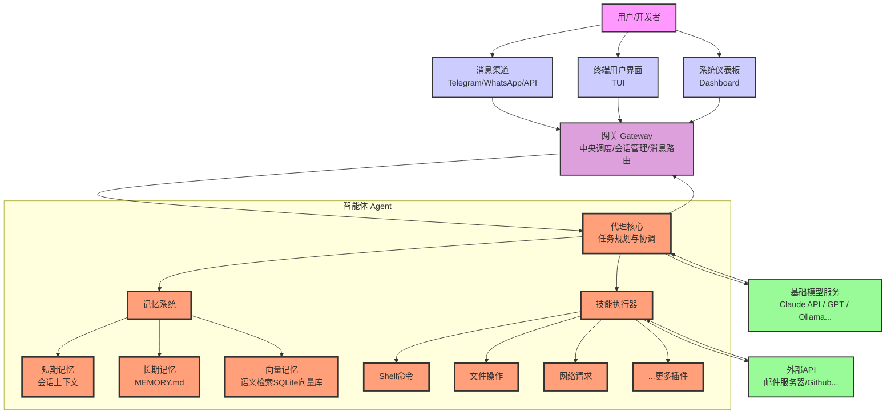

# OpenClaw

## 参考资料

- [openclaw docs](https://docs.openclaw.ai/)
- [openclaw github](https://github.com/openclaw/openclaw)

## 安装

环境：tencentcloud Ubuntu Server 24.04 LTS 64bit

```bash
# 下载安装 Node.js
# 先到官方网站 https://nodejs.org/en/download 获取稳定版本和下载链接
curl -O https://nodejs.org/dist/v24.13.1/node-v24.13.1-linux-x64.tar.xz
tar -xJvf node-v24.13.1-linux-x64.tar.xz

# 添加环境变量
vi ~/.bashrc
export PATH=$PATH:/home/ubuntu/node-v24.13.1-linux-x64/bin
source ~/.bashrc

# 验证安装情况
node --version
npm --version
# 更换为国内镜像
npm config set registry https://mirrors.cloud.tencent.com/npm/

# 下载安装 OpenClaw
curl -fsSL https://openclaw.ai/install.sh | bash
# 初始化配置并启动为守护进程
openclaw onboard --install-daemon
# 检查服务状态
openclaw gateway status
# 启动 web 仪表板
openclaw dashboard
```

## 访问方式

### 远程服务器访问 dashboard
```bash
# 本地终端执行 SSH 隧道转发
ssh -N -L 18789:127.0.0.1:18789 ubuntu@xxx.xxx.xxx.xxx
# 本地浏览器访问
http://127.0.0.1:18789/
```

### 本地直接访问
```bash
openclaw tui
```

## OpenClaw 架构

以下内容使用 claude code for vscode + qwen3-coder-plus 分析 github 源代码生成，并经过个人简单编辑：

OpenClaw 是一个AI网关系统，旨在提供一个运行在用户个人设备上的AI助手。该项目能够通过多种通信渠道（如WhatsApp、Telegram等）与用户交互。

**项目类型**：多渠道AI网关系统
**技术栈**：TypeScript、Node.js
**核心目标**：提供一个本地化、快速响应、始终在线的个人AI助手
**适用场景**：个人用户希望在常用通讯渠道中获得AI助手服务，同时保护隐私

### 网关 (Gateway)

Gateway 是 OpenClaw 的核心组件，充当 WebSocket 和 HTTP 服务器，负责处理客户端连接、认证、设备管理、代理调用等功能。负责：

- 提供HTTP和WebSocket接口服务
- 管理聊天和消息传递
- 认证和权限控制
- 消息路由和处理
- 处理与AI模型的通信

### AI代理 (Agents)

Agent 是 OpenClaw 中的智能体，具有模型推理、工具调用、沙箱执行、身份验证、会话管理等功能。负责：

- 提示工程和上下文管理，包括会话 Session 、技能 Skills 、记忆 Memory 等
- AI对话管理
- 模型选择和负载均衡
- 认证配置文件管理和轮换
- 错误处理和恢复机制

### 消息渠道 (Channels)

Channels 为 OpenClaw 集成了多个消息渠道：

- 支持多种消息渠道（WhatsApp、Telegram等）
- 实现消息路由和身份验证
- 处理不同的消息格式和协议
- 提供统一的通道抽象接口

### CLI 命令行和 Dashboard 界面

OpenClaw 提供了完整的 CLI 命令行界面和 Dashboard web 管理界面，支持：

- 系统安装和配置
- 网关启动和管理
- 消息发送
- 配置管理
- 插件管理
- 等等

### 4.2 数据流

1. 用户通过任一消息渠道发送请求
2. 对应通道接收并验证消息
3. 消息被转发至Gateway
4. Agent加载上下文并处理消息
5. Gateway与AI模型通信
6. 响应返回给相应的消息通道
7. 通道将响应发送回用户

### 项目结构

分析使用 2026-02-25 e0201c2774b8465b3bde85a097196a7241b51ab1 提交版本：

```
openclaw/
├── apps/                       # 移动端和桌面端应用 (iOS, Android, macOS)  
├── assets/                     # 静态资源
├── docs/                       # 文档
├── extensions/                 # 扩展功能
├── git-hooks/                  # Git钩子
├── skills/                     # 预设技能
├── src/                        # 核心源代码
│   ├── acp/                    # Agent Client Protocol
│   ├── agents/                 # AI代理核心逻辑
│   ├── auto-reply/             # 自动回复功能
│   ├── browser/                # 浏览器自动化
│   ├── canvas-host/            # Canvas功能
│   ├── channels/               # 消息通道通用逻辑
│   ├── cli/                    # 命令行界面
│   ├── commands/               # 命令处理
│   ├── compat/                 # 兼容性工具
│   ├── config/                 # 配置管理
│   ├── cron/                   # 定时任务
│   ├── daemon/                 # 守护进程
│   ├── discord/                # Discord通道
│   ├── gateway/                # 核心网关逻辑
│   ├── hooks/                  # 钩子系统
│   ├── imessage/               # iMessage通道
│   ├── infra/                  # 基础设施工具
│   ├── line/                   # LINE通道
│   ├── link-understanding/     # 链接解析
│   ├── logging/                # 日志系统
│   ├── markdown/               # Markdown处理
│   ├── media/                  # 媒体处理
│   ├── media-understanding/    # 媒体理解
│   ├── memory/                 # 记忆系统
│   ├── node-host/              # 节点主机
│   ├── pairing/                # 配对系统
│   ├── plugins/                # 插件系统
│   ├── plugin-sdk/             # 插件SDK
│   ├── providers/              # 模型提供商
│   ├── routing/                # 路由系统
│   ├── scripts/                # 脚本
│   ├── security/               # 安全功能
│   ├── sessions/               # 会话管理
│   ├── shared/                 # 共享代码
│   ├── signal/                 # Signal通道
│   ├── slack/                  # Slack通道
│   ├── telegram/               # Telegram通道
│   ├── terminal/               # 终端功能
│   ├── test-helpers/           # 测试辅助
│   ├── test-utils/             # 测试工具
│   ├── tts/                    # 文字转语音
│   ├── tui/                    # 终端用户界面
│   ├── types/                  # 类型定义
│   ├── utils/                  # 工具函数
│   ├── web/                    # Web相关功能
│   ├── whatsapp/               # WhatsApp通道
│   ├── wizard/                 # 向导系统
│   ├── entry.ts                # 入口文件
│   ├── index.ts                # 主入口文件
│   └── logger.ts               # 日志记录
├── ui/                         # 用户界面
└── test/                       # 测试文件
```

### 架构图


OpenClaw 架构主要包括：

- **TUI (Terminal UI)**: 终端界面，适合快速操作
- **Dashboard**: 提供图形化Web管理界面
- **Channels**: 多种接入渠道，支持不同交互方式
- **Gateway**: 网关，所有交互的唯一出入口，处理请求分发和路由
- **Agent**: 智能体，核心功能
- **Skills**: 技能，Agent可以使用的技能包
- **Memory**: 记忆，Agent可以从长期记忆、每日笔记和当前会话中获取上下文
- **Models**: 模型，Agent调用模型来规划任务和执行

## 核心配置文件

```bash
vi ~/.openclaw/openclaw.json
```

## 常用 openclaw 命令

### 配置管理
```bash
# 查看当前配置
openclaw config show

# 设置配置项
openclaw config set <key> <value>

# 重置配置
openclaw config reset

# 导出配置
openclaw config export > backup-config.json

# 导入配置
openclaw config import < backup-config.json
```

### 服务管理
```bash
# 检查网关状态
openclaw gateway status

# 启动网关服务
openclaw gateway start

# 停止网关服务
openclaw gateway stop

# 重启网关服务
openclaw gateway restart

# 查看网关日志
openclaw gateway logs
```

### 模型管理
```bash
# 列出所有可用模型
openclaw models list

# 查看当前默认模型
openclaw models current

# 设置默认模型
openclaw models set <model-name>

# 测试模型连接
openclaw models test <model-name>
```

### 技能管理
```bash
# 列出所有技能
openclaw skills list

# 安装技能
openclaw skills install <skill-name>

# 更新技能
openclaw skills update <skill-name>

# 卸载技能
openclaw skills uninstall <skill-name>

# 查看技能详情
openclaw skills show <skill-name>

# 启用技能
openclaw skills enable <skill-name>

# 禁用技能
openclaw skills disable <skill-name>
```


### 通道管理
```bash
# 列出所有通道
openclaw channels list

# 查看通道状态
openclaw channels status <channel-name>

# 启用通道
openclaw channels enable <channel-name>

# 禁用通道
openclaw channels disable <channel-name>
```

## 个人理解

openclaw 最大的意义在于让个人能够编辑 agent ，构建个性化的工作流程，帮助完成一些简单的工作任务。

openclaw 的架构也可以支持一些多 agent 的复杂应用。

它仍然是提示词工程的一种应用。
