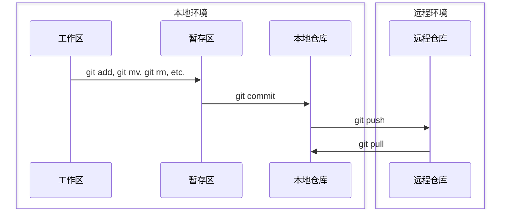

# git

## 参考资料

[git book](https://git-scm.cn/book/)


## 基本概念

git 是一个分布式版本控制系统（Distributed Version Control Systems, DVCS）。客户端不仅仅是签出文件的最新快照；它们会完整地镜像存储库，包括其完整的历史记录。

> [!note]
> Git 项目的三个主要部分：工作目录（working tree）、暂存区（staging area）和 Git 目录（Git directory）。
> 
> * 工作目录，或称为**工作区**，是你项目中某个版本的单个检出。这些文件从 Git 目录中的压缩数据库中提取出来，放在磁盘上供你使用或修改。
> 
> * **暂存区**是一个文件，通常包含在你的 Git 目录中，它存储了有关将要包含在下一个提交中的信息。
> 
> * Git 目录（通常是.git文件目录），或称为 **git 本地仓库**，是 Git 存储项目元数据和对象数据库的地方。这是 Git 最重要的部分，当你从另一台计算机克隆（clone）一个仓库时，它会被复制。

除此之外，还有一个重要的概念： git 远程仓库（git repository）。

> [!note]
> * **git 远程仓库**是您项目托管在互联网或网络上的版本。远程仓库可以位于您的本地机器上。“远程”一词不一定意味着仓库位于网络的另一端或互联网上，只表示它在别处。

--------------------------------------------------------------------------------

> [!tip]
> 基本的 Git 工作流程大致如下：
> 
> 1. 创建本地仓库（同步远程仓库副本 `git clone`，或是创建一个空的仓库 `git init`）。
> 
> 2. 在工作区中修改文件。
> 
> 3. 选择性地暂存你想包含在下一次提交中的更改 （`git add` 、 `git mv` 和 `git rm` 等），这会将仅这些更改添加到暂存区。
> 
> 4. 执行提交操作 `git commit`，该操作将暂存区中的文件作为当前状态，并将该快照永久存储到你的 git 本地仓库中。
> 
> 5. 本地仓库向远程仓库同步版本 `git push`。

--------------------------------------------------------------------------------



--------------------------------------------------------------------------------

Git 本地仓库文件可以存在于三个主要状态：已修改（modified）、已暂存（staged）和已提交（committed）。

已修改（Modified）表示你更改了文件，但尚未将其提交到本地数据库。

已暂存（Staged）表示你已将某个已修改文件的当前版本标记为将包含在下一个提交快照中。

已提交（Committed）表示数据已安全地存储在你的本地数据库中。


## git 基础配置

### git config

Git 提供了一个名为 git config 的工具，可以让你获取和设置控制 Git 外观和操作各个方面的配置变量。这些变量可以存储在三个不同的位置

1. `[path]/etc/gitconfig` 文件：包含应用于系统上所有用户及其所有仓库的值。如果你向 `git config` 传递 `--system` 选项，它会专门从此文件读取和写入。由于这是一个系统配置文件，你需要管理员或超级用户权限才能对其进行更改。

2. `~/.gitconfig` 或 `~/.config/git/config` 文件：个人用户特定的值。你可以通过传递 `--global` 选项来让 Git 专门从此文件读取和写入，这会影响你系统上所有仓库的所有操作。

3. 你当前使用的任何仓库的 Git 目录下的 `config` 文件（即 `.git/config`）：特定于该单个仓库。你可以通过 `--local` 选项强制 Git 从此文件读取和写入，但实际上这就是默认行为。不出所料，要使此选项正常工作，你需要位于 Git 仓库的某个目录下。

每个级别都会覆盖前一个级别的设置，因此 `.git/config` 中的值会覆盖 `[path]/etc/gitconfig` 中的值。

你可以使用以下命令查看所有设置及其来源

`git config --list --show-origin`

--------------------------------------------------------------------------------

安装 Git 后，你应该做的第一件事是设置你的用户名和电子邮件地址。这很重要，因为每次 Git 提交都会使用此信息，并且这些信息会不可更改地嵌入到你开始创建的提交中。

`git config --global user.name "Mcfflz"`
`git config --global user.email mcfflz@qq.com`

--------------------------------------------------------------------------------

现在你的身份已经设置好，你可以配置 Git 在需要你输入消息时使用的默认文本编辑器。如果未配置，Git 会使用你的系统默认编辑器。

`$ git config --global core.editor "'D:/devtools/npp8.9.1/notepad++.exe' -multiInst -notabbar -nosession -noPlugin"`

--------------------------------------------------------------------------------

默认情况下，当你使用 git init 创建新仓库时，Git 会创建一个名为 master 的分支。从 Git 版本 2.28 开始，你可以为初始分支设置不同的名称。
要将 main 设置为默认分支名称，请执行

`git config --global init.defaultBranch main`

或者可以在创建仓库后，更改仓库名

`git branch -m master main`

--------------------------------------------------------------------------------

如果你想检查你的配置设置，可以使用 `git config --list` 命令列出 Git 在该点可以找到的所有设置

你可能会看到键出现多次，因为 Git 会从不同的文件（例如 `[path]/etc/gitconfig` 和 `~/.gitconfig`）读取相同的键。在这种情况下，Git 会使用它看到的每个唯一键的最后一个值。

你还可以通过输入 `git config <key>` 来检查 Git 如何看待特定键的值。


## git 创建本地仓库和工作区

### git init

`git init <directory>` 将一个目录变成一个新的 Git 本地仓库，并开始对其进行版本控制。

`--bare` 可以设置为 git 远程仓库。


### git remote

`git remote` 命令是用于管理远程仓库记录的管理工具。它允许你将长 URL 保存为简短的句柄，例如“origin”，这样你就不用每次都输入它们了。

`git remote add <remote_name> <url>` 在本地仓库添加一个指向的远程仓库。

`git remote remove <remote_name>` 在本地仓库删除一个指向的远程仓库。


### git fetch

`git fetch` 命令会与远程仓库通信，下载你当前仓库中没有的该远程仓库中的所有信息，并将其存储在你的本地数据库中。


### git checkout

`git checkout <branch_name>` 命令会从本地仓库中获取指定分支的数据，同时变更工作区文件。


### git switch

`git switch <branch_name>` 命令会从本地仓库中获取指定分支的数据，同时变更工作区文件。和 `checkout` 效果相同。


### git clone

获取一个已有的 git 远程仓库的副本。

`git clone` 命令实际上是几个其他命令的包装。它创建一个新目录 `mkdir` ，进入该目录并运行 `git init` 来将其初始化为一个空的 Git 仓库，然后添加一个指向你提供的 URL 的远程（默认名为 `origin`，使用 `git remote add`），运行 `git fetch` 从该远程仓库获取仓库信息，最后使用 `git checkout` 将最新的提交检出到你的工作区。

`git clone` 会抓取远程所有 refs，但仅在本地创建并检出默认分支 main/master。

`git clone --depth <n>` 浅克隆，同步远程仓库副本的历史深度是 n，当远程仓库过大，且不需要追溯历史文件时使用。


## git 本地工作

### git add

`git add <files>` 命令将工作区中的内容添加到暂存区（或“索引”）以供下一次提交。


### git rm

`git rm <files>` 命令会从工作区删除文件，并将该删除操作加入暂存区。


### git mv

`git mv <files>` 命令移动或重命名文件、目录，并记录到暂存区。


### git restore

放弃对工作区的文件改动。

`git restore <filename>` 丢弃工作目录中对文件的修改，用暂存区（或最近一次提交）中的文件覆盖工作目录中的文件。
`git restore --staged <filename>` 取消暂存文件（从暂存区移出），将文件从最近的一次提交（HEAD）恢复到暂存区（index），但不会影响工作区。相当于取消暂存（unstage）这个文件，但保留工作目录中的修改。


### git status

`git status` 显示工作区和暂存区文件的不同状态：哪些文件已修改但未暂存，哪些已暂存但尚未提交。


### git diff

`git diff <filename>` 显示工作区和暂存区文件之间的差异。可以指定文件名和暂存区的版本。

在 IDE 中查看变更内容会更方便。


### git commit

`git commit` 将 `git add` 命令暂存的所有文件内容记录到数据库中形成一个新的永久快照，然后将当前分支的指针向前移动到该快照。
`git commit -m "<comments>"` 同时记录提交内容。


### git reset

`git reset` 命令可以撤销提交操作。


### git clean

`git clean` 命令用于从工作目录中删除不需要的文件。这可能包括删除临时构建产物或合并冲突文件。


## git 分支管理

### git branch

创建、列出或删除分支。

`git branch -r` 查看所有远程分支

`git branch -a` 查看所有远程分支+本地分支

`git branch <branch_name>` 从当前分支创建一个新的分支，相当于 `git branch -c <this_branch> <branch_name>` 

`git branch -d <branch_name>` delete a branch

`git branch -D <branch_name>` delete a branch --force

`git branch -m <old_branch_name> <new_branch_name>` move or rename a branch

`git branch -M <old_branch_name> <new_branch_name>` move or rename a branch --force

`git branch -c <old_branch_name> <new_branch_name>` copy a new_branch from old_branch

`git branch -C <old_branch_name> <new_branch_name>` copy a new_branch from old_branch --force


### git merge

`git merge <branch_name>` 将目标分支内容合并到当前分支，会附带目标分支所有变更历史。

`git merge <branch_name> --squash` 执行压缩合并，不保留分支历史。


## git 多仓库管理

### git submodule

`git submodule` 命令用于管理普通仓库中的外部仓库。这可以是库或其他类型的共享资源。submodule 命令有几个子命令（add、update、sync 等）用于管理这些资源。


## git 团队协作

### git pull

`git pull` 命令基本上是 `git fetch` 和 `git merge` 命令的组合，Git 会从你指定的远程仓库获取，然后立即尝试将其合并到你当前的分支中。


### git push

`git push` 命令用于与另一个仓库通信，计算出你的本地数据库中有而远程仓库中没有的内容，然后将差异推送到另一个仓库。它需要对另一个仓库的写访问权限，所以通常会经过某种身份验证。

`git push --force` 将本地仓库分支强制推送到远程仓库分支。谨慎使用。


### git 工作流

简单版，只有 `main` 分支、 `dev` 分支。

```bash
# 获取远程仓库
git remote add origin git_repository.git
git fetch
# 切换到本地开发分支
git switch dev
git branch local
# 编辑和提交
git status
git add .
git commit -m "something to say"
# 分支合并
git switch dev
git pull
git merge local
git push
# 删除本地开发分支
git branch -d local
```


## git 撤销或删除提交记录

### git revert

`git revert` 用于创建一个新的提交，以撤销其他提交所引入的更改。

`git revert <commit-hash1> <commit-hash2> ...` 可以撤销指定提交的修改，恢复到提交前的状态

`git revert HEAD` 可以撤销最近的提交

`git revert <commit-hash1>^..<commit-hash2>` 可以撤销指定区间内的提交


### git reset

`git reset` 移动 HEAD 指针指向，以添加或移除当前分支中的提交。此操作会改变提交历史（git log）。也可用于恢复暂存区，与 `git restore` 的功能有重叠。

`--soft`：只移动分支指针，不修改暂存区和工作区

`--mixed（默认）`：移动分支指针并重置暂存区，但不修改工作区

`--hard`：彻底重置：移动指针、重置暂存区和工作区（丢失所有未提交更改）

`git reset --soft <commit-hash>` 将当前分支移动到指定提交。


## git 安全管理

使用 SSH 公钥可以让你在本地仓库和 Github/Gitee/Gitcode 等管理平台的远程仓库通讯的时候使用安全连接。


### windows 生成公钥

```bash
# 生成 ed25519 公钥
# 邮箱只是实例，用来标识该公钥。一些托管机构会要求邮箱必须是注册邮箱。
ssh-keygen -t ed25519 -C "your_email@example.com"
```

### windows 读取公钥

```bash
cat ~/.ssh/id_ed25519.pub
# 可以变更公钥名称以区分不同的远程仓库，但必须以类似于 id_ed25519 的加密算法名称开头，否则 git 可能无法找到
mv ~/.ssh/id_ed25519.pub ~/.ssh/id_ed25519_github_account.pub
mv ~/.ssh/id_ed25519 ~/.ssh/id_ed25519_github_account
```

### 添加公钥

在 Github/Gitee/Gitcode 等管理平台的账号下添加 .pub 公钥内容，并用一个名称标识它。


## git 常见问题

### error setting certificate verify locations

[error setting certificate verify locations解决办法_未名who的博客-CSDN博客](https://blog.csdn.net/qq_2300688967/article/details/81096693)

方法一：调整ssl证书路径

```bash
# 把"D:/ProgramFiles/Git"替换为本地安装路径即可
git config --system http.sslcainfo "D:/ProgramFiles/Git/mingw64/ssl/certs/ca-bundle.crt"
```

方法二：关闭ssl证书校验

```bash
git config --system http.sslverify false
```

### git 文件名大小写敏感问题

[解决 Git 默认不区分文件名大小写和同名文件共存的问题 - 简书 (jianshu.com)](https://www.jianshu.com/p/30a255cfab0d)

当 git 文件大小写不敏感时，容易造成文件更名后的重复，导致提交失败的问题。此时需要配置 git 大小写敏感：

```bash
# 项目设置
git config core.ignorecase false
# 全局设置
git config --global core.ignorecase false
```

同时，对于不需要留存的文件，需要对远端文件进行删除。


### LF will be replaced by CRLF in ...(<filename>)

linux 环境以 LF 为换行符；windows 环境以 CRLF 为换行符。

warning 级别告警，可以忽略。

